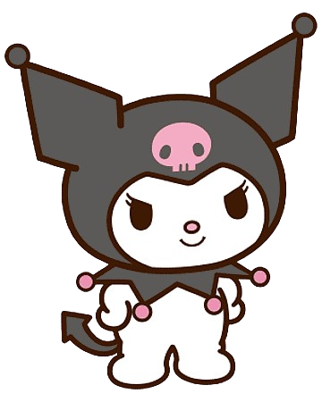

# Projeto 1 - Página de Diário ✨

Bem-vindo ao **Projeto 1 - Página de Diário**! Este projeto é uma página web estilizada com o tema da Kuromi, feita para registrar e compartilhar entradas de diário de forma divertida, acessível e responsiva.



## 🌐 Deploy Online

Acesse a versão online do projeto em:
👉 [tutoria-boticario-desenvolve.vercel.app](https://tutoria-boticario-desenvolve.vercel.app/)

## 🚀 Funcionalidades
- **Visual moderno e fofo** com tema Kuromi
- **Responsivo**: funciona bem em celulares, tablets e desktops
- **Acessibilidade**: foco visível para navegação por teclado
- **Modo escuro automático** (respeita as preferências do sistema)
- **Fácil customização** de cores e estilos via CSS

## 📁 Estrutura do Projeto
```
Projeto 1 - Página de Diário/
├── index.html         # Página principal do diário
├── style.css          # Estilos customizados (tema Kuromi)
└── images/            # Imagens utilizadas no site
    ├── kuromi_fundo.png
    ├── kuromi_principal.png
    └── kuromi2.png
```

## 🖥️ Como Visualizar Localmente
1. **Clone ou baixe** este repositório.
2. Abra a pasta `Projeto 1 - Página de Diário` no seu computador.
3. Clique duas vezes no arquivo `index.html` para abrir no navegador.

> Não é necessário instalar nada! Basta abrir o arquivo HTML.

## 🎨 Customização
- Para alterar cores, fontes ou imagens, edite o arquivo `style.css`.
- As variáveis CSS estão centralizadas no início do arquivo para facilitar a personalização do tema.

## ♿ Acessibilidade
- O site possui foco visível para navegação por teclado.
- Cores e contrastes pensados para melhor leitura.

## 📱 Responsividade
- Layout adaptado para diferentes tamanhos de tela.
- Teste no seu celular ou redimensione o navegador para ver!

## ☁️ Deploy com Vercel

O deploy estático foi realizado usando o [Vercel](https://vercel.com/):
- Basta conectar o repositório ao Vercel e definir a pasta `Projeto 1 - Página de Diário` como Root Directory nas configurações do projeto.
- O Vercel detecta automaticamente projetos estáticos e publica o site.

## 💡 Créditos
- Tema inspirado na personagem **Kuromi** (Sanrio)
- Feito com carinho para o Desafio Boticário Desenvolve

---

> Sinta-se à vontade para modificar, compartilhar e se inspirar neste projeto!